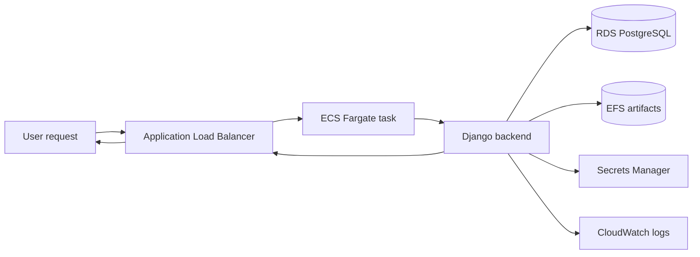

# NZ Bird Sound Database: AWS Backend Deployment

This repository is the AWS-ready version of the NZ Bird Sound Django backend. The original app worked as a normal backend; this version focuses on making it deployable, observable, testable, and safer to run as a public service.

Original application repository: [giddypergrid/NZBirdSoundDatabase](https://github.com/giddypergrid/NZBirdSoundDatabase-Backend)

Main additions in this version:

- Docker image build and deployment through GitHub Actions.
- ECS Fargate runtime behind an Application Load Balancer.
- RDS PostgreSQL instead of a database living on the app server.
- EFS-mounted bird data, classifier files, and semantic-search artifacts.
- Secrets Manager for database password and Django secret key.
- CloudWatch logs and an unhealthy-target alarm.
- Live pytest coverage, k6 load testing, and a manual rollback workflow.
- Backend request guards for heavier ML endpoints, so the service returns controlled `503` responses instead of silently overloading.

Runtime request flow:



The most useful part of this work was not just getting the container online. A few production-style issues came up and were fixed along the way: Linux entrypoint formatting, RDS/EFS security group wiring, Django `ALLOWED_HOSTS`, static file ownership inside the container, missing mounted artifact paths, slow ML warmup, and controlled back-pressure for expensive endpoints.

## 1. CI/CD Pipeline

This project uses four GitHub Actions workflows. The main deploy path is automatic on `main`; the heavier checks and rollback are manual.

### 1.1 Build, Deploy, and Test Backend (`.github/workflows/build-image.yml`, `ecs-task-definition.json`, `DjangoProject/Dockerfile`)

Workflow file: `.github/workflows/build-image.yml`

Flow:

```text
Git push
-> Build: Docker image -> commit-tagged ECR image
-> Deploy: render task definition -> register ECS revision -> update ECS service -> wait stable
-> Test: run live API tests against the ALB
```

Key setup:

| Area | Setup |
| --- | --- |
| AWS access | GitHub uses OIDC to assume `github-actions-ecr-nz-birdsound`. |
| ECR | The IAM role can push the commit-tagged Docker image to ECR. |
| ECS deploy | The IAM role can register task definitions, pass `ecsTaskExecutionRole`, and update the ECS service. |
| Task config | I first created the task definition in AWS, then moved the useful parts into `ecs-task-definition.json` so the deployment config is tracked in Git instead of only living in the console. |
| Migration gate | CI runs `python manage.py makemigrations --check --dry-run` before building the image, so model changes cannot deploy unless their migration files are committed. |

The workflow started as image build/push only. It now checks migration drift, builds the image, registers an immutable ECS task revision, waits for service stability, and runs live API tests against the deployed backend.

Screenshot evidence:

| Workflow summary |
| --- |
|  |

| Build | Deploy | Live tests |
| --- | --- | --- |
|  |  |  |

### 1.2 Live API Tests Only (`.github/workflows/live-tests-only.yml`, `tests/live/`, `requirements-test.txt`)

Workflow file: `.github/workflows/live-tests-only.yml`

Flow:

```text
Manual run -> Install test dependencies -> Run pytest against public ALB
```

Key setup:

| Area | Setup |
| --- | --- |
| Trigger | Manual `workflow_dispatch`. |
| Target | Public ALB URL. |
| Dependencies | `requirements-test.txt`. |
| Command | `python -m pytest tests/live -v`. |

Screenshot evidence:

| Live API tests workflow | Live API tests job steps |
| --- | --- |
|  |  |

### 1.3 Manual k6 Load Test (`.github/workflows/load-test.yml`, `load/k6-live-smoke.js`)

Workflow file: `.github/workflows/load-test.yml`

Flow:

```text
Manual run -> Set up k6 -> Run phased load test -> Check thresholds
```

Key setup:

| Area | Setup |
| --- | --- |
| Trigger | Manual `workflow_dispatch` to avoid accidental load and AWS cost. |
| Tool | `grafana/setup-k6-action@v1`. |
| Script | `load/k6-live-smoke.js`. |
| Target | Public ALB URL. |

Screenshot evidence:

| Manual k6 workflow | Manual k6 job steps |
| --- | --- |
|  |  |

### 1.4 Rollback ECS Deployment (`.github/workflows/rollback-ecs.yml`)

Workflow file: `.github/workflows/rollback-ecs.yml`

Flow:

```text
Manual revision input -> Verify revision ACTIVE -> Update ECS service -> Wait stable
```

Key setup:

| Area | Setup |
| --- | --- |
| Trigger | Manual `workflow_dispatch`. |
| Input | ECS task-definition revision number. |
| Safety check | Selected revision must be `ACTIVE`. |
| Action | Existing ECS service is updated to the selected revision. |

Rollback is manual on purpose. It lets me choose a known-good ECS task revision and redeploy it without rebuilding the Docker image.

Screenshot evidence:

| Rollback workflow | Rollback job steps |
| --- | --- |
|  |  |

## 2. AWS Runtime Evidence

The final AWS setup is split by responsibility: ECS runs the container, ALB handles public traffic, RDS owns PostgreSQL, EFS stores large runtime artifacts, ECR stores images, Secrets Manager keeps secrets out of the image, and CloudWatch records logs and health signals.

### 2.1 Runtime Resources

| Evidence | What it proves | Screenshot |
| --- | --- | --- |
| Target group health (`ecs-task-definition.json`) | ALB can reach the ECS task on port `8000`; target is healthy. |  |
| ECS service health (`ecs-task-definition.json`, `DjangoProject/entrypoint.sh`) | Service is active, deployment succeeded, revision `7` is running. |  |
| EFS artifacts (`DjangoProject/Bird_Sound/key_files.py`) | Artifact file system is available and stores `44.34 GiB` of model/media data. |  |
| CloudWatch alarm (`ecs-task-definition.json`) | Unhealthy target alarm exists and is currently `OK`. |  |
| Application Load Balancer (`ecs-task-definition.json`) | Internet-facing ALB routes `HTTP:80` traffic to the backend target group. |  |
| RDS PostgreSQL (`DjangoProject/DjangoProject/settings.py`) | Database is available on PostgreSQL using `db.t4g.micro`. |  |
| ECR images (`DjangoProject/Dockerfile`, `.github/workflows/build-image.yml`) | Docker images are stored with commit tags and `latest`. |  |
| Secrets Manager (`ecs-task-definition.json`) | Runtime secrets are stored outside the image and injected at deployment. |  |
| CloudWatch logs (`ecs-task-definition.json`, `DjangoProject/DjangoProject/settings.py`) | ECS container logs are centralized in `/ecs/nz-birdsound-backend`. |  |

### 2.2 EFS Artifact Loading (`ecs-task-definition.json`, `DjangoProject/Bird_Sound/key_files.py`, `DjangoProject/Bird_Sound/warmup.py`)

EFS is mounted into the container at `/mnt/artifacts`. That keeps the Docker image focused on code instead of baking in 40GB+ of bird audio, images, model files, and vector/search artifacts.

One early deployment failed because the container expected local project folders that did not exist inside AWS. Moving those folders into EFS made the runtime file paths explicit and repeatable.

Runtime paths:

| Asset type | Container path | Used by |
| --- | --- | --- |
| Seed/reference data | `/mnt/artifacts/seed` | startup data load |
| Classifier artifacts | `/mnt/artifacts/BirdClassify` | audio classification |
| Semantic-search artifacts | `/mnt/artifacts/birdTextTraining` | text/vector search |

The app warms heavy dependencies during startup through `warmup.py`. That way the first user request is less likely to trigger a sudden model-load spike.

Secrets also moved out of local `.env` files. In ECS, the database password and `DJANGO_SECRET_KEY` are injected from Secrets Manager, so they are not stored in the image or committed to Git.

CloudWatch became the main debugging surface during deployment. It exposed real startup failures such as missing EFS paths, database connection mistakes, static file permission errors, and Django host validation errors.

## 3. Testing

### 3.1 Test Design

The live tests are intentionally written against the public ALB URL, not a mocked local server. That made them useful for catching real deployment issues: bad security group wiring, missing EFS files, wrong environment variables, failed health checks, and slow/heavy endpoints.

The suite started with basic endpoint checks, then expanded after deployment failures. It now covers bad parameters, missing routes, invalid methods, media retrieval, semantic search, and controlled overload behavior.

| Test group | Load / cases | Expected status / result |
| --- | --- | --- |
| Live API pytest (`tests/live/`) | `33` tests | `33/33` pass |
| Health endpoint (`tests/live/test_live_api.py`) | parallel burst | all `200` |
| Bird list/detail (`tests/live/test_live_api.py`) | sampled live bird IDs | `200`; required JSON fields present |
| Missing bird (`tests/live/test_live_api.py`) | 1 fake bird ID | `404` |
| Unknown URL (`tests/live/test_live_abuse_cases.py`) | 1 fake route | `404` |
| Media retrieval (`tests/live/test_live_api.py`) | sampled image/audio files | `200`; valid content type |
| Bad query params (`tests/live/test_live_abuse_cases.py`) | invalid quantity/top_k/etc. | `400` |
| Path traversal (`tests/live/test_live_abuse_cases.py`) | encoded `../` attempts | `400` or `404` |
| Wrong HTTP methods (`tests/live/test_live_abuse_cases.py`) | `POST`, `PUT`, `DELETE` on read-only endpoints | `405` |
| Semantic search (`tests/live/test_live_api.py`) | normal text query | `200`; result list present |
| Classify bad extension (`tests/live/test_live_abuse_cases.py`) | invalid upload filename | `400` |
| Classify empty body (`tests/live/test_live_abuse_cases.py`) | no upload body | `400` |
| Classify oversized upload (`tests/live/test_live_abuse_cases.py`) | large fake upload | `400` or `413` |
| Semantic traffic guard (`tests/live/test_live_traffic_guard.py`) | `5` concurrent requests | mix of `200` and `503`; at least `1` `503` |
| Classify traffic guard (`tests/live/test_live_traffic_guard.py`) | `4` concurrent requests | mix of `200` and `503`; at least `1` `503` |
| k6 smoke (`load/k6-live-smoke.js`) | `1.5` iterations/sec for `60s` | all smoke checks pass; failed request rate `<1%` |
| k6 throttle (`load/k6-live-smoke.js`) | `3` iterations/sec for `60s` | mix of `200` and `429`; at least `1` `429` |

### 3.2 Test Coverage

| Test area | Tool | What was tested | Expected behavior | Latest result |
| --- | --- | --- | --- | --- |
| Live API health | pytest | `/birds/api/healthz/` in `tests/live/test_live_api.py` | `200 OK`, app and DB healthy | Passed |
| Bird data API | pytest | list/detail endpoints in `tests/live/test_live_api.py` | Stable JSON contract | Passed |
| Media retrieval | pytest | image/audio retrieval in `tests/live/test_live_api.py` | Valid file stream and content type | Passed |
| Semantic search | pytest | text search in `tests/live/test_live_api.py` | `200 OK`, structured result | Passed |
| Abuse input | pytest | bad params, traversal, bad methods in `tests/live/test_live_abuse_cases.py` | Controlled `400`, `404`, or `405` | Passed |
| Traffic guard | pytest | heavy endpoint pressure in `tests/live/test_live_traffic_guard.py` and `DjangoProject/Bird_Sound/middleware.py` | Controlled `503` back-pressure | Passed |
| Load smoke | k6 | phased public traffic in `load/k6-live-smoke.js` | Thresholds pass, no failed requests | Passed |

Latest local verification:

| Test suite | Command | Result |
| --- | --- | --- |
| Live pytest suite | `python -m pytest tests/live -v` | `33 passed in 38.69s` |
| k6 load test | `k6 run load/k6-live-smoke.js` | `285/285 checks passed`, `0.00%` failed requests |

Both suites were run against the deployed public ALB endpoint, so the results include ECS, ALB, RDS, EFS, and application behavior together.

Key k6 results:

| Metric | Result |
| --- | --- |
| Controlled throttle responses | `61` |
| Controlled guard responses | `6` |
| Smoke p95 health latency | `121.12ms` |
| Smoke p95 image latency | `564.91ms` |
| Smoke p95 audio latency | `289.97ms` |
